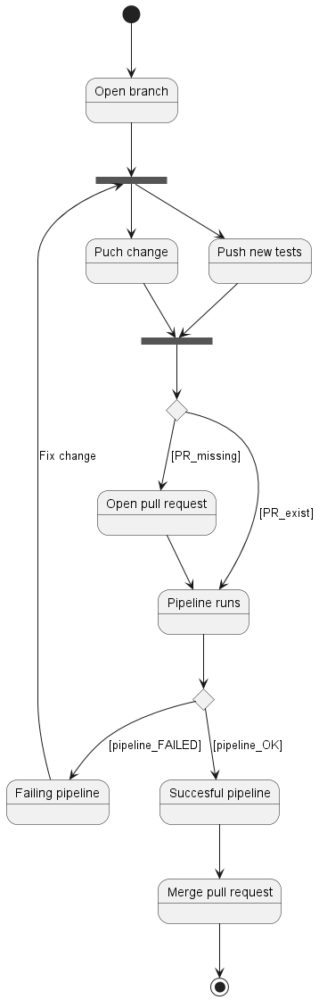

# Demo to prevent software regressions
This project contains a basic API to perform the following tasks:
- Create a new task
- Get all tasks
- Get a specific task by ID
- Delete all tasks

## Pipeline automation
This state diagram shows the change process from the view of the developer. 
The developer starts by opening a branch to implement a small branch to implement the changes. After he pushed all changes and tests to git, he creates a pull request. The pipeline runs automatically. It is not possible to merge the pull request without a successful pipeline. 
When the tests in the pipeline are good, regressions are prevented.
After a successful pipeline run, the developer can merge the small change into the main branch. In the case of a project with more contributors, a pull request approval should be added as a requirement to merge as well.

## Available tests/pipeline steps
### Unit tests

### API tests

### Test coverage

### Static code scans
With static code scan plugins like [prospector](https://github.com/PyCQA/prospector) which is used in this pipeline, common errors can be prevented and the quality of the code increases because of specified rules which are checked automatically. In addition, static security scans like [bandit](https://github.com/PyCQA/bandit) can spot potential security issues in the code and those could be fixed directly.